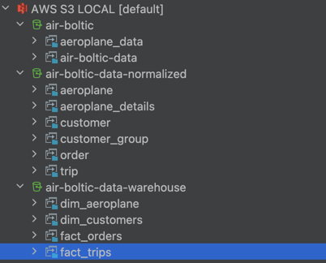
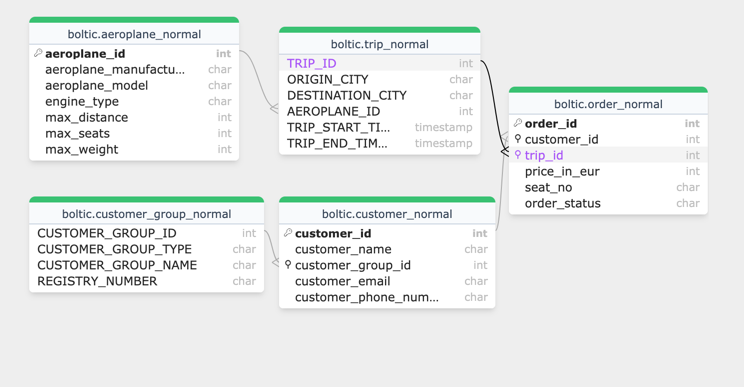
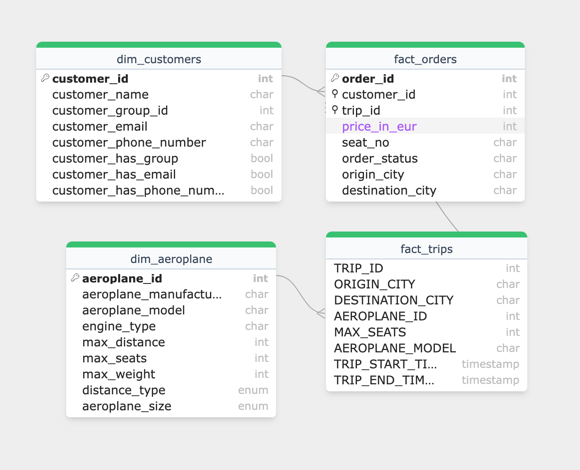

## Air Boltic Data Modelling

Hey! This repository demonstrates an ELT example for air boltic!. For a full run of the model have a look at this [GH Actions](https://github.com/baslare/spark_dbt_localstack/actions/runs/13422015338/job/37496630154
) run! 
I've chosen the tools to reflect the functionality defined in the task:

- **S3 for data storage**
  - Localstack container with s3 enabled, very basic hive partitioning.
- **Databricks for compute and data exploration**:
  - Pyspark to extract/clean data and save normalized tables to an s3 bucket.
- **dbt for data transformations**:
  - dbt + spark thrift server to create a toy data warehouse example.
  - data stored in s3 as parquet files.
- **Looker for reporting and self-service analytics**
  - duckdb python script to demonstrate a few queries, on the DWH.
- **GitHub to keep our scripts organised**:
  - well, this repo and GH Actions to demonstrate that the example works.

All of these are organized in a docker-compose.yml file. You can have a look at the runs in GitHub Actions. 
The commands (e.g. queries) have their output written, where applicable.

The modelling approach I had is something similar to a star schema in a data warehouse. While this is obviously a very simplified example, the main ideas would stay the same:

- The goal is to provide a DWH solution that allows for an efficiently queryable self-service storage.
- This calls for an OLAP approach, but the data we receive seems normalized. For the sake of simplicity,
I just added the files provided in the task in the localstack bucket (_air-boltic_)
- pyspark extracts, cleans and writes these files akin to normalized tables in another bucket in s3 (_air-boltic-normalized_)
- this allows for a scalable/high volume data storage. Since we don't necessarily need to query these normalized layer that much, storing them as parquet files should be acceptable.
- to imitate dbt-databricks functionality, I used a [spark-thrift](https://github.com/dbt-labs/dbt-adapters/blob/main/dbt-spark/docker-compose.yml) server as a [backend for dbt](https://docs.getdbt.com/docs/core/connect-data-platform/spark-setup). 
- basically, dbt runs a macro to load the normalized parquet files to spark ( [macros](/macros/create_external_tables.sql)).
- when the table creation is complete, dbt runs its [models](/models) to load the files to yet another bucket (_air-boltic-data-warehouse_)
- then I run a few analytical queries using duckdb on these files/tables. columnar storage should be good for these analytical queries!

this is how the s3 buckets look like:

- while technically we can't have primary/foreign keys in spark, the conceptual connections are still there.
- This is how the table relatonships look like in the normalized stage.
- - Notice that the `aeroplane_normal` table has fields from the json file provided in the task. This is done in the pyspark extract step.

- but this is obviously not suited to be an OLAP system, as I mentioned - I've created something similar to a star schema.
Where all the relevant tables are only one degree removed from each other.
After dbt transformations (not really invasive due to the task's simplicity) this is how the model looks like, note that foreign keys are only added to show the relations.

 

- coupled with column storage, this model is much more suited to our use case! we can have access to certain insights using only a single join in most cases.
- you can refer to the latest GH Actions run and the [queries.py](queries.py) file for some queries using the results of the dbt models!
- A better approach would be to use Delta Lake Tables to have ACID capability, as the parquet files I have implemented don't have this.
- We could do with more transformations that could help with some queries and provide some insights.
- dbt could definitely be incremental. pyspark could upsert the normalized files. especially for "dimension" tables where "append" strategy doesn't make much sense (e.g. when customer info changes, appending would just be wrong).
- 

Questions:

- _Let’s imagine you have implemented a pipeline that makes your data model from Part 1
available to users. As you can imagine, our business will evolve and become more complex
over time, requiring changes in your data model. Let’s also imagine you have absolutely no
limitations on tooling or resources. How would you envision the ideal CI/CD process to
implement these changes over time?_

- All the release, pre/post deployment checks and processes could be automated!
- The most obvious problem with my setup would be its inability to handle schema changes.
- But since we're already in github it's a start! All the schema evolutions/migrations should be version-controlled and tested, ideally in a CI/CD pipeline, using dbt's testing capability.
- We'd probably need a staging/review environment where we can test the changes.
- We'd definitely need some sort of monitoring/alerting tool to execute the steps I implemented. E.g. airflow would make a lot of sense here
since 1) the dbt model would probably need to run several times a day 2) it consists of several steps that need to be orchestrated 3) and we'd definitely need to know when and how the pipeline fails.
- We'd probably need much more logging that I have implemented :) 

- _How would your answer differ in the real world use case where resources are limited
and perfect tooling might not be available? What are some of the low effort/short term
and high effort/long term things you would suggest we implement?_

- It wouldn't differ that much in terms of direction, there's definitely some low hanging fruits here.
- dbt testing capabilities are definitely useful and provide great value.
- even with the local setup I came up with could be useful to test the entire pipeline, from start to finish. This is especially useful when we can't afford a review/staging environment.
We can create tests around this setup. In my experience such E2E tests provide amazing value, coupled with the usual unit and integration tests.
- We'd gain a lot of value from automating tests in GH Actions.

Well, this is it! I hope you enjoyed it as much as I did, I obviously spent more than the recommended time, but I wanted to show what I enjoy doing and what I'm capable of doing. 
In the end, it's all about that, isn't it! :) 

All the best,
Efe
